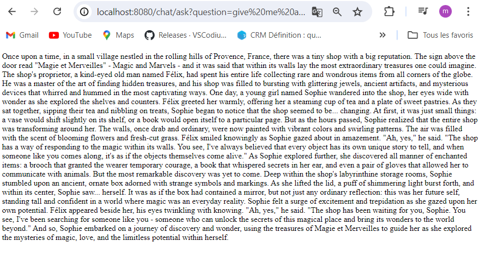
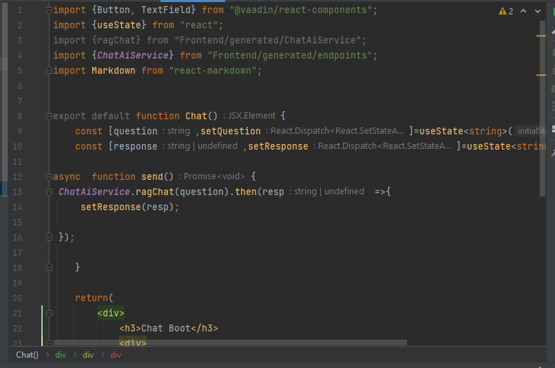

#  Chat Boot RAG Spring React
Application web fullstack Spring React qui permet mettre en oeuvre 
un Chat Bot Basé sur un système RAG avec les LLMs llama3 et openAI. 
L'application utilise Spring AI coté backend et React coté Frontend en utilisant VAADIN.

# Image de test de llama3 sur le terminal de mon pc

# Image du reponse 1 depuis le navigateur

# Image du reponse 2 depuis le navigateur

# Image du lancement de l'application depuis le navigateur

# Image de la reponse du chatbot avec zone de text

# Image des codes ******************************

# Image de la structure du projet

# Base de donnée utilisé pour la partie rag

# Image de la page index

# Image de la page chatAiService

# Image de la page chatPage

# Image de la page chatRestController

# Image de la page LayoutPage

